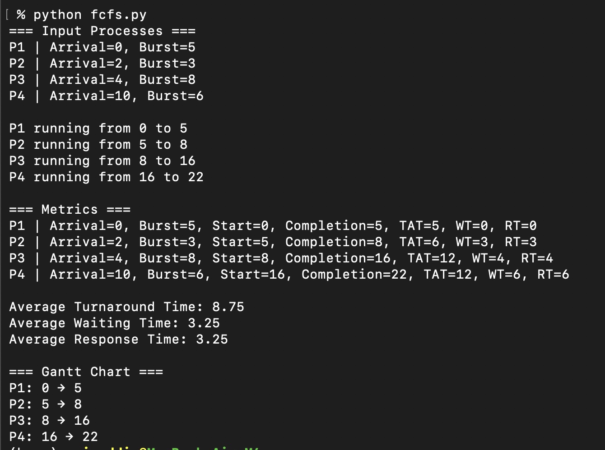
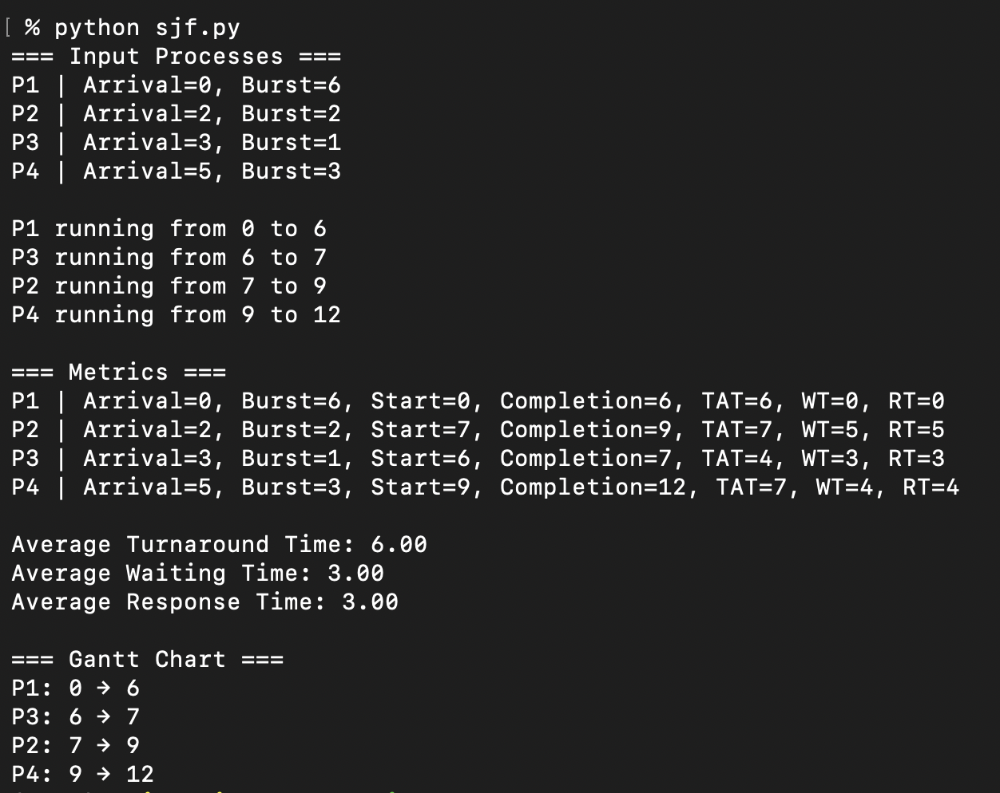
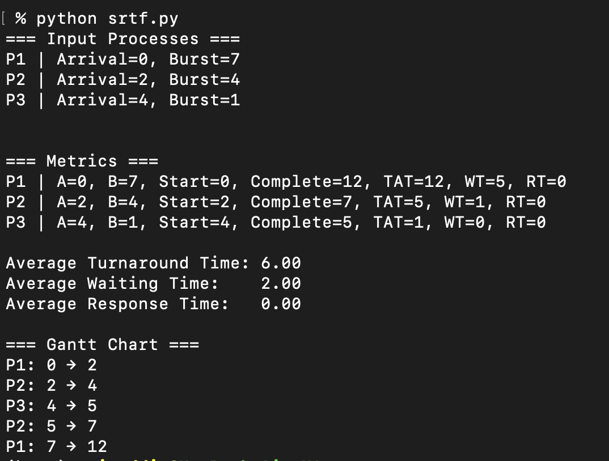
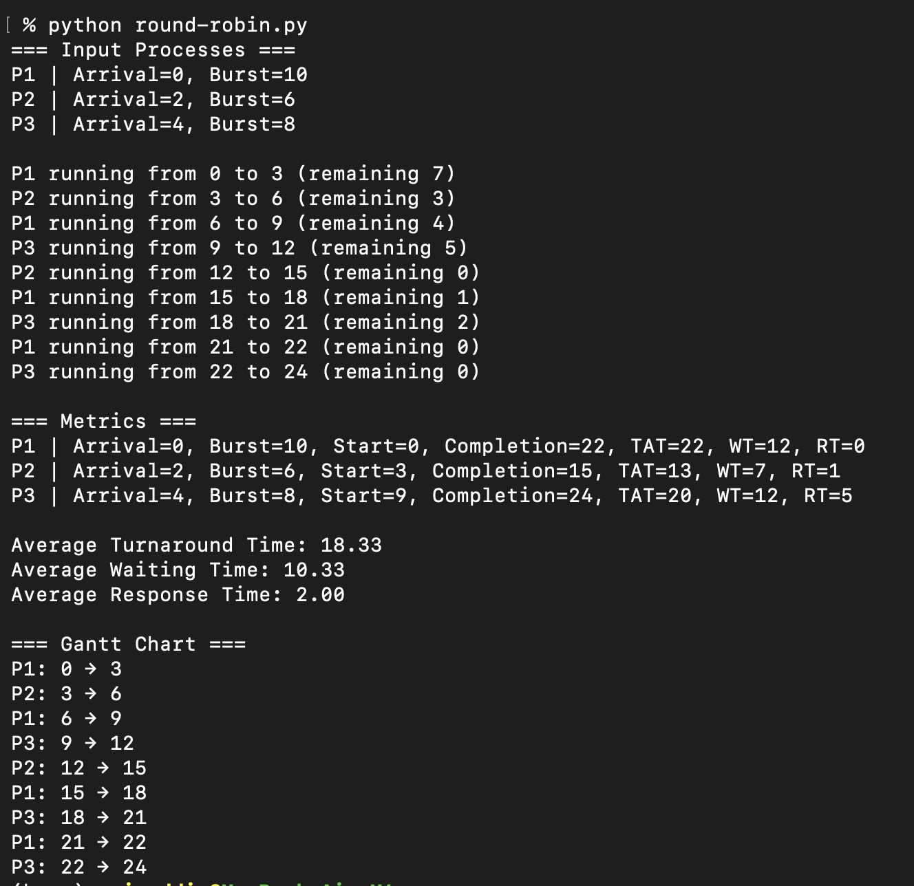
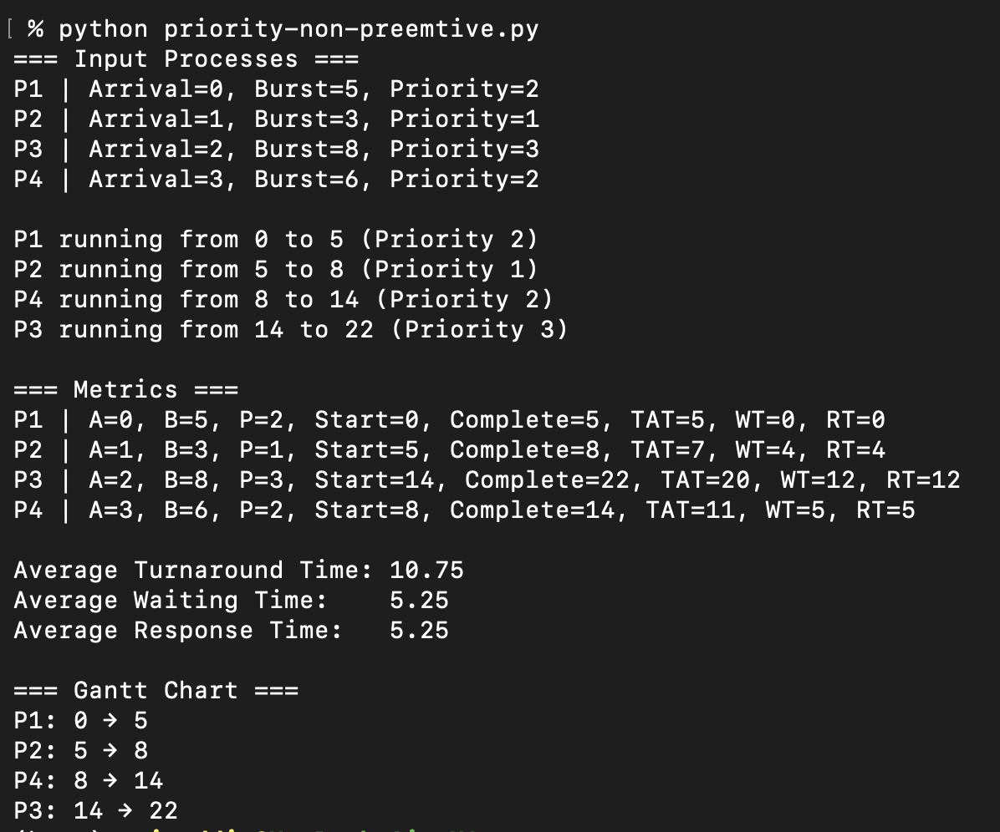
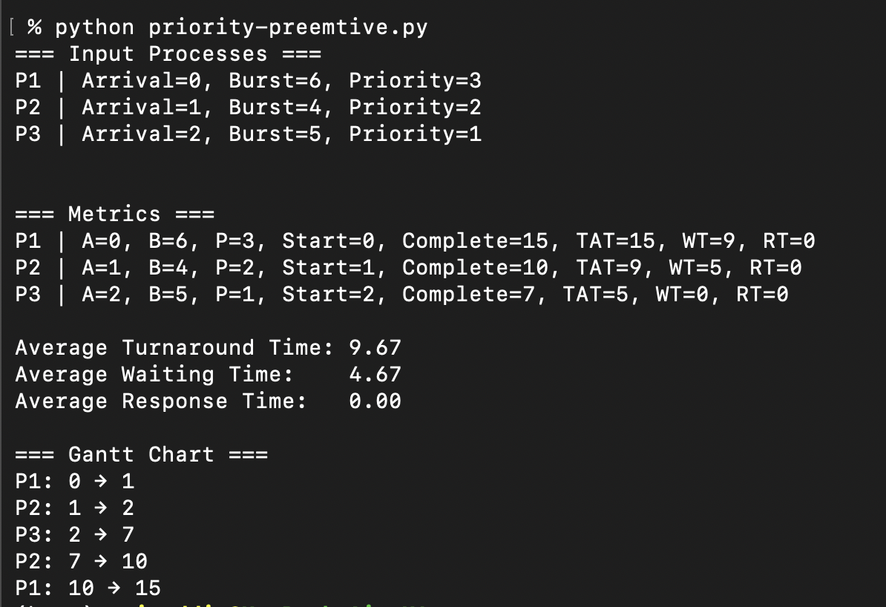

# CPU Scheduling Simulation (Python + SimPy)

Simple, educational simulations of classic CPU scheduling algorithms using Python and the SimPy discrete-event framework.

Algorithms included:
- First-Come, First-Served (FCFS)
- Shortest Job First (SJF, non-preemptive)
- Shortest Remaining Time First (SRTF, preemptive)
- Round Robin (RR)
- Priority (Non-Preemptive)
- Priority (Preemptive, optional aging)


## Requirements

- Python 3.8+
- SimPy (`simpy`)

Install SimPy:

```bash
pip install simpy
```

Optional: create and activate a virtual environment first.

```bash
python -m venv .venv
source .venv/bin/activate   # Windows: .venv\Scripts\activate
pip install simpy
```


## How To Run

Each algorithm is a standalone script. From the repo root, run any of:

```bash
python fcfs.py
python sjf.py
python srtf.py
python round-robin.py
python priority-non-preemtive.py
python priority-preemtive.py
```

On start, each script prints the input process list, then logs execution slices, followed by per‑process metrics and a simple Gantt chart (text).


## Input And Configuration

Edit the process list and parameters directly in each script:

- Common: `procs = [ Process(name, arrival, burst, [priority]) ]`
- Round Robin: set `quantum` in `round-robin.py`
- Context switch overhead: set `CTX` (where available)
- Priority (preemptive): `AGING`, `AGING_INTERVAL`, `AGING_STEP` in `priority-preemtive.py`

All scripts print:

- `=== Input Processes ===` – the process list
- Execution logs – e.g., `P1 running from 0 to 5`
- `=== Metrics ===` – per‑process Turnaround Time (TAT), Waiting Time (WT), Response Time (RT), and averages
- `=== Gantt Chart ===` – simple timeline segments


## Algorithms Overview

- FCFS (`fcfs.py`)
  - Non-preemptive. Processes run in order of arrival.

- SJF (`sjf.py`)
  - Non-preemptive shortest job first. Among arrived processes, runs the one with the smallest burst.

- SRTF (`srtf.py`)
  - Preemptive SJF. Always runs the process with the shortest remaining time; may preempt when a shorter job arrives. Supports optional context switch overhead `CTX` and logs IDLE/CTX slices.

- Round Robin (`round-robin.py`)
  - Time-slicing with fixed `quantum`. Preemptive; ready queue cycles processes until completion.

- Priority Non-Preemptive (`priority-non-preemtive.py`)
  - Lower numeric value = higher priority. Picks highest priority among ready processes. Optional `CTX` overhead.

- Priority Preemptive (`priority-preemtive.py`)
  - Preempts when a ready process has higher priority (lower number). Optional aging to reduce starvation: toggle `AGING` and adjust intervals/step.


## Screenshots

Captured sample outputs are embedded below for quick reference:

**FCFS**


**SJF**


**SRTF**


**Round Robin**


**Priority — Non-Preemptive**


**Priority — Preemptive**



## Troubleshooting

- ModuleNotFoundError: No module named 'simpy' → `pip install simpy`
- Using multiple Python versions → ensure you run with the interpreter that has SimPy installed (e.g., `python3` vs `python`).


## Notes

- For educational purposes only. Metrics and timelines are kept simple to make the logic easy to follow.
- coded by zainuddin@codemaster.my
- for educational purposes only
